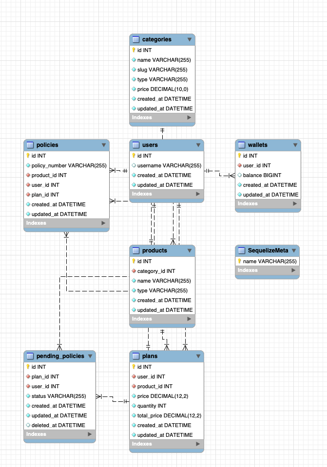

# InsuranceTech API
Welcome to InsuranceTech API, a backend solution designed to manage insurance plans, policies, and user interactions. The application models key relationships between users, products, plans, pending policies, and activated policies, providing a structured and scalable way to manage your insurance operations.

## Overview

InsuranceTech API allows users to:

1. Purchase plans based on available products.
2. Manage wallets to fund their insurance purchases.
3. Track pending policies (unused slots) associated with plans.
4. Activate pending policies to create official policies for users.
5. Query activated policies and filter them by plan.

## Key Features

1. Product Management: List products with pricing and categories.
2. Plan Purchases: Users can purchase plans based on product quantity and deduct wallet balance accordingly.
3. Pending Policies: Automatically generate unused policy slots when a plan is purchased.
4. Policy Activation: Convert pending policies into activated policies.
5. User Wallets: Manage wallets to enable purchases and track balances (Wallet balance are stored in units of kobo).
6. Model Relationships: Establish strong relationships between users, products, plans, and policies.

## API Endpoints

https://documenter.getpostman.com/view/11352884/2sAYQZHs5Z

## Getting Started

### Requirements
1. Node.js version 18 and above
2. PostgresSQL database


### Installation

1. clone the repository
2. install dependencies (yarn install or npm install)
   ```
   # using npm
   npm install
   
   # using yarn
   yarn install
   ```
3. configure database and environment
    ```
    # create .env file at the root of your project
    # update .env file with database credentials like below
    DB_USERNAME=*****
    DB_PASSWORD=*****
    DB_DATABASE=insurancetech
    DB_HOST=localhost
    DB_PORT=3306
    PORT=3000
    NODE_ENV=development
   ```
4. Run migration and seeders (yarn run db:fresh or npm run db:fresh)
    ```
   yarn run db:fresh 
   OR
   npm run db:fresh
   ```
5. Start server (yarn run start or npm run start)
    ```
    yarn run start
   OR
    npm run start
   ```
6. Run test (yarn run test or npm run test)
    ```
    yarn run test
    OR
    npm run test
    ```

## Database Schema




